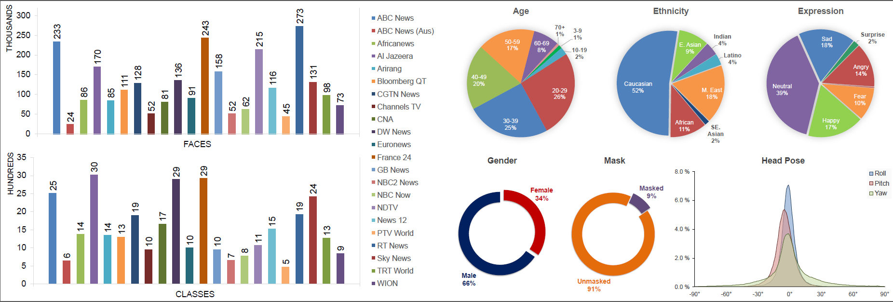
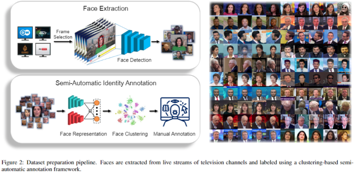

# TVFace
Official Repository for "Towards Large-scale Unsupervised Face Recognition in Video Streams".

## Abstract

Recent advances in deep learning have led to significant improvements in the performance of face recognition systems, but completely automated recognition remains an elusive goal, particularly in videos at scale. Existing approaches to video face recognition are optimized for short-form content, such as movies and television shows, containing a limited number of faces and identities. Large-scale face datasets are mostly based on web images and do not represent the challenges of the video domain. We present TVFace, a large-scale dataset of face images extracted from public live streams of international news channels, and containing a total of 2.6 million images and 33 thousand identities. Identity labeling is performed using a clustering-based, semi-automatic annotation framework designed to facilitate manual annotation of large collections of face images. TVFace is the first large-scale face dataset sourced from long-form video content and is well-suited for evaluating face representation and identity classification components in both image and video domains, as well as for multiple tasks including identification and clustering. We also design a tree search-based Hierarchical Retrieval Index for fast face matching in order to demonstrate the effectiveness of the proposed dataset in evaluating real-time person retrieval systems.



Please fill the form below to send a request for acquiring the download link for the dataset from the authors.

https://docs.google.com/forms/d/165AYNU9iGQA-wEpH68jEfjnGzJdF_ljFkZNSjOaO3qU

## Streamface 

A framework for extraction of face datasets from YouTube videos and livestreams.



### Installation

Clone repository and install required packages using
```
pip install -r requirements.txt
```

### Usage

#### 1. Frame Collection

```python
from streamface.stream_capture import StreamCapture

capture = StreamCapture(
    name='skynews',
    url='https://www.youtube.com/watch?v=9Auq9mYxFEE',
    output_dir='./data/skynews',
    batch_size=50,
    empty_threshold=0.95,
    blur_threshold=50,
    similarity_threshold=0.9,
    reconnect_interval=500,
    log_interval=100
)

capture.call()
```

#### 2. Face Extraction

```python
from streamface.face_extraction import FaceExtraction

extract = FaceExtraction(
    input_dir='./data/skynews',
    output_dir='./data/skynews',
    detection='retinaface',
    batch_size=32,
    conf_threshold=0.95,
    size_threshold=0.005,
    blur_threshold=25,
    match_thresholds=(0.75, 0.75),
    face_size=(256, 256),
    aligned_size=(128, 128),
    padding=0.5,
    margin=1.0,
    resume=True,
    log_interval=100
)

extract.call()
```

#### 3. Face Analysis

```python
from streamface.face_analysis import FaceAnalysis

analyze = FaceAnalysis(
    input_dir='./data/skynews',
    output_dir='./data/skynews',
    representation='arcfacenet',
    demographics='fairface',
    expression='dfemotion',
    mask='chandrikanet',
    pose='whenet',
    batch_size=128,
    resume=True,
    log_interval=100
)

analyze.call()
```

#### 4. Feature Evaluation

```python
from streamface.feature_evaluation import FeatureEvaluation


model = FeatureEvaluation(
    name='skynews',
    features_path='./data/skynews/features/xyz.pkl',
    metric='cosine',
    max_samples=30000,
    k=5000,
    thresholds=list(np.arange(0.1, 0.4, 0.025))
)

model.evaluate()
```

#### 5. Face Clustering

```python
from streamface.face_clustering import FaceClustering


cluster = FaceClustering(
    features_path='./data/skynews/features/xyz.pkl',
    matches_path='./data/skynews/metadata/matches.csv',
    faces_dir='./data/skynews/faces',
    output_dir='./data/skynews',
    metric='cosine',
    linkage='complete',
    matching_threshold=0.3,
    matching_batchsize=20000,
    merging_threshold=0.5,
)

cluster.call()
```

#### 6. Cluster Evaluation

```python
from streamface.cluster_evaluation import ClusterEvaluation


model = ClusterEvaluation(
    name='skynews',
    features_path='./data/skynews/features/xyz.pkl',
    annotations_path='./data/skynews/metadata/annotations.json',
    scores_path='./data/skynews/metadata/cluster_scores.pkl',
    plots_path='./data/skynews/metadata',
    metric='cosine',
)

model.evaluate()
```

#### 7. Cluster Matching

```python
from streamface.cluster_matching import ClusterMatching


model = ClusterMatching(
    features_path='./data/skynews/features/xyz.pkl',
    annotations_path='./data/skynews/metadata/annotations.json',
    evals_path='./data/skynews/metadata/cluster_evals.json',
    metric='cosine',
    topk=10000,
    min_threshold=0.35,
    max_threshold=0.5,
    mode='average',
)

model.match()
```

#### 8. Manual Annotation

```python
from streamface.fiftyone_annotation import FiftyOneAnnotation


model = FiftyOneAnnotation(
    name='skynews',
    faces_path='./data/skynews/faces',
    evals_path='./data/skynews/metadata/cluster_evals.json',
    annotations_path='./data/skynews/metadata/annotations.json',
    new_annotations_path='./data/skynews/metadata/annotations_manual.json',
)

model.annotate()
```

#### 9. Evaluate Annotations

```python
from streamface.annotation_evaluation import AnnotationEvaluation


evaluator = AnnotationEvaluation(
    true_annotations_path='./data/skynews/metadata/annotations_manual.json',
    pred_annotations_path='./data/skynews/metadata/annotations.json',
)

evaluator.evaluate(verbose=True)
```

## Hierarchical Retrieval Index 

Tree search-based fast face matching algorithm.

[Link to Repository](https://github.com/atifkhurshid/hri)
